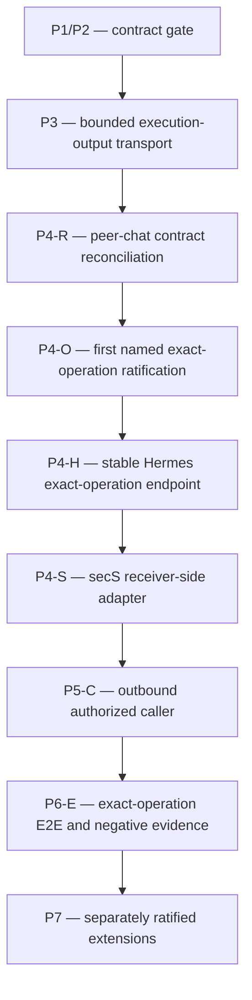

# secS/Hermes exact-operation implementation DAG

Date: 2026-07-18
Reconciled: 2026-07-23
Status: current control surface; P1/P2 and P3 complete; P4-R in progress through Issue #270; P4-O through P7 blocked
Contract: [../specs/secs-hermes-peer-chat-contract.md](../specs/secs-hermes-peer-chat-contract.md)

## Objective

Replace the superseded peer-chat delivery sequence with a gated path for one operator-ratified exact authority-bearing machine operation. Matrix remains the conversation plane. secS preserves distinct caller credentials, receiver-local authority, denial-before-handler behavior, bounded authenticated output, and strict non-leakage.

This plan ratifies no operation, identifier, schema, endpoint, ABI, IPC, transport, socket, route, package, repository owner, or runtime implementation.

## Active dependency DAG



The active serialized sequence is exactly:

```text
P4-R -> P4-O -> P4-H -> P4-S -> P5-C -> P6-E -> P7
```

P1/P2 and P3 are completed prerequisites. No runtime implementation may cross an unresolved edge. Read-only contract audits may run in parallel, but implementation remains serialized by the active edges.

## Live baseline

- P1/P2 contract governance completed through Issues #261/#262.
- P3 completed through closed Issue #263 and merged PR #264.
- The protected P3 head `c3c87bedb9a3cee8aeb9ad4d25f52cb096cb2c27` contains exactly 12 ordered commits.
- Merge commit `358b232a3c0de2f96f63b41ffa276c5ae469c19e` landed P3; post-merge Rust CI run [30047659428](https://github.com/ZenithResearch/secS-magik/actions/runs/30047659428) passed.
- Post-P3 status synchronization completed through #267/#268.
- Identity-fixture hygiene completed through #266/#269 at clean base `801ce5a7f954107dfb9a83d1cb7c2b93d4d76ad3`.
- Issue #270 owns P4-R only. It authorizes contract/governance reconciliation and no runtime implementation.

## Active node table

| Node | Status | One-PR objective | Dependency | Gate to unlock the next node |
|---|---|---|---|---|
| P1/P2 — contract gate | Complete via #261/#262 | Preserve credential references, distinct caller identity, receiver verification/policy, signed context, response, and non-leakage invariants. | Historical baseline | Completed evidence remains provenance; peer-chat delivery commitments are superseded. |
| P3 — bounded execution-output transport | Complete on `main` via #263/#264 | Preserve signed exact-request-correlated bounded `ExecutionResponse`, unchanged `DecisionResponse`, and digest-only receipt projections. | P1/P2 complete | Exact P3/C1–P3/C12 history and green post-merge CI. |
| P4-R — peer-chat contract reconciliation | In progress via #270 | Supersede `agent.chat.v1`, chat schemas, prompt projection, chat-completions/API-key delivery, peer-chat profile/plugin, and mutual-chat targets while preserving P1/P3 invariants. | P3 and #266/#267 complete on `main` | PR merged, post-merge `main` CI passes, issue evidence reconciled. |
| P4-O — first named exact-operation ratification | Blocked by P4-R | Obtain an operator-ratified first named operation before any implementation, including exact authority/resource/schema/bounds/freshness/replay/idempotency/receipt/non-claim semantics. | P4-R merged and post-merge green | One accepted operation contract; no placeholder, generic identifier, or multiplexer. |
| P4-H — stable Hermes exact-operation endpoint | Blocked by P4-O | Expose one stable fail-closed local Hermes operation boundary for the ratified operation only. | P4-O merged and post-merge green | Focused endpoint contract and implementation evidence without generic API-server or caller-controlled dispatch. |
| P4-S — secS receiver-side adapter | Blocked by P4-H | Bind verified secS authority to the fixed P4-H boundary for the ratified operation. | P4-H merged and post-merge green | Denial-before-dispatch, exact resource/attenuation, bounded response, and redaction evidence. |
| P5-C — outbound authorized caller | Blocked by P4-S | Construct and authenticate the single declared operation without caller-selected receiver-local controls. | P4-S merged and post-merge green | Credential/reference safety, exact request/response validation, and fail-closed negative evidence. |
| P6-E — exact-operation E2E and negative evidence | Blocked by P5-C | Prove authorized success plus the complete identity/authority/replay/resource/response/redaction negative matrix. | P5-C merged and post-merge green | Reproducible evidence in one owning repository; repair nodes merged first if defects are found. |
| P7 — separately ratified extensions | Future after P6-E | Add only separately ratified operations or transports through their own contracts and DAG nodes. | P6-E merged and post-merge green | Each extension has an operator-ratified contract and independent negative evidence. |

## Superseded node table

The former delivery nodes are historical provenance only. They are explicitly superseded, not renamed into the active sequence.

| Former node | Status | Superseded commitment |
|---|---|---|
| Former P4 — receiver-local Hermes adapter | Superseded | Fixed chat-completions delivery, `API_SERVER_KEY` plumbing, trusted metadata system prompt, and dedicated peer-chat profile. |
| Former P5 — outbound Hermes plugin client | Superseded | `agent.chat.v1` peer/profile selection and outbound chat plugin delivery. |
| Former P6 — mutual peer and negative evidence | Superseded | A-to-B/B-to-A mutual-chat target and chat-specific evidence matrix. |

The former P7 schema-driven chat extension rule is also inactive. The active P7 permits only separately ratified operations or transports after P6-E; it does not revive chat or expose discovered endpoints automatically.

## P4-R — contract reconciliation

Issue: https://github.com/ZenithResearch/secS-magik/issues/270

P4-R changes only the contract, this plan, implementation status, both documentation indexes, and the executable governance test. It preserves historical filenames and adds no changelog or runtime source change.

Acceptance:

- Matrix owns conversation, and chat text/Matrix events are not executable authority;
- secS admits exact authority-bearing machine operations only;
- the generic Hermes API server stays disabled;
- all former peer-chat delivery commitments are explicitly superseded;
- P1/P3 authority, response, redaction, and historical-verification invariants remain intact;
- no first operation, operation ID, schema, endpoint, ABI, IPC, transport, package, repository owner, or runtime implementation is ratified.

P4-R is not complete merely because its PR checks are green. Completion requires merge, post-merge `main` CI, issue evidence reconciliation, and controller-authorized issue closure.

## P4-O — first exact-operation contract gate

P4-O must ratify one named operation before any implementation. Its issue must define:

1. the operation name and purpose without a generic placeholder;
2. caller and receiver-held authority policy;
3. exact resource binding, attenuation, and non-amplification;
4. request and response semantics;
5. input, output, and timeout bounds;
6. freshness, replay, and idempotency rules;
7. receipt persistence and disclosure rules;
8. complete acceptance/negative matrix and non-claims.

P4-O ratifies semantics only. It must not preselect a local ABI, IPC mechanism, transport, socket, route, endpoint, package, repository, handler implementation, URL, header, key, opcode, model, provider, prompt, role, tool, toolset, workspace, session, or plugin.

## Implementation-node boundaries

- P4-H owns only the stable Hermes local boundary for the already-ratified operation.
- P4-S owns only the secS receiver-side adapter to that fixed boundary.
- P5-C owns only the outbound authorized caller.
- P6-E owns evidence, not opportunistic defect fixes.
- P7 owns only later separately ratified operations/transports.

The execution rule is **one DAG node = one issue = one PR**. Each checked task is one commit unless its live issue explicitly records a narrower mapping. A node may collect evidence from multiple repositories but may modify only its owning repository.

Package and repository ownership remain unratified until the owning node's accepted issue resolves them from live source evidence.

## Repair-node rule

If P4-H, P4-S, P5-C, or P6-E discovers a defect outside its accepted boundary, stop and insert an explicit repo-owned repair node before dependent work resumes. Use a node name derived from the blocked parent and owning surface, give it one issue and one PR, add its table row and DAG edges before implementation, and merge it with green post-merge CI before returning to the blocked node.

Unmodeled child PRs, bundled cross-repository fixes, and evidence-only claims that bypass a required repair node are forbidden.

## P3 immutable governance history

Issue #263 is closed and PR #264 is merged. The protected P3 head `c3c87bedb9a3cee8aeb9ad4d25f52cb096cb2c27` contains exactly 12 ordered commits.

Commits 1–8 are an immutable protected prefix ending at `3d14174c966f075debce84cccb9e8c9d9b887bf2`. Commit 9 is the single additive final-review correction.

Commits 1–9 are an immutable protected prefix ending at `ada11e55a90d3e59632b90af67a07ef54bc5b53d`. Commit 10 is the single additive final CTO correction.

Commits 1–10 are an immutable protected prefix ending at `e5012a36b4cb166c71928c746fec014de330fd03`. Commit 11 is the single additive roundtable correction.

Commits 1–11 are an immutable protected prefix ending at `26f23ce2d07ea992c2ad8dd1c15fad6736fa8f3d`. Commit 12 is the sole additive governance-test correction. No Commit 13 is authorized by #263.

P3 is complete on `main` through merge commit `358b232a3c0de2f96f63b41ffa276c5ae469c19e`; post-merge Rust CI run [30047659428](https://github.com/ZenithResearch/secS-magik/actions/runs/30047659428) succeeded. P4-R adds no P3 commit and does not change P3 wire, response, receipt, or historical-verification behavior.

## Transition and post-merge gates

A node completes only after:

1. its issue acceptance and one-PR scope are reconciled;
2. TDD RED/GREEN evidence exists for implementation changes;
3. focused and required repository gates pass;
4. security, authority, and redaction checks pass;
5. PR comments and required independent reviews are resolved on one exact head;
6. the PR merges;
7. post-merge `main` CI passes;
8. issue state, status ledger, indexes, and this DAG are reconciled.

Green PR checks alone do not complete a node. No descendant begins before the predecessor's post-merge gate is satisfied.

## Stop conditions

Stop and return to design if any node:

- relabels chat, arbitrary prompts, or `agent.chat.v1` as an exact operation;
- invents a generic operation identifier or machine-operation multiplexer;
- authorizes implementation before P4-O operator ratification;
- changes P3 `DecisionResponse`, `ExecutionResponse`, receipt, or historical verification semantics;
- permits caller-selected receiver controls;
- enables the generic Hermes API server as an authority boundary;
- smuggles a package, repository, ABI, IPC, transport, socket, route, endpoint, schema, URL, path, header, key, handler, model, provider, prompt, role, tool, toolset, workspace, session, plugin, or opcode choice through an earlier node;
- treats Matrix conversation as executable authority or makes Matrix integration depend on this DAG.