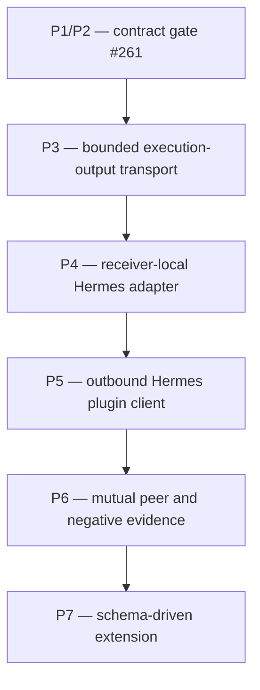

# secS/Hermes peer-chat implementation DAG

Date: 2026-07-18
Status: current control surface; P1/P2 complete via #261/#262; P3 implemented by #263 in draft PR #264 pending authorized merge and green post-merge main CI; P4–P7 blocked
Contract: [../specs/secs-hermes-peer-chat-contract.md](../specs/secs-hermes-peer-chat-contract.md)

## Objective

Deliver one symmetric authenticated Hermes A↔B chat path through secS while preserving distinct per-agent credentials, receiver-local authority, denial-before-handler behavior, bounded output, and strict non-leakage.

Internal Hermes tool gating is deferred and is not in this DAG's first-slice dependency path.

## Dependency DAG



Serialized execution edges:

```text
P1/P2 --> P3
P3 --> P4
P4 --> P5
P5 --> P6
P6 --> P7
```

Read-only audits of downstream contracts may run in parallel. Runtime implementation does not cross an unresolved dependency edge.

## Live baseline reconciled on 2026-07-18

- Repository: `ZenithResearch/secS-magik` `main` at `184a347dd` (post-#258) when #261 was filed.
- The latest `main` push `Rust CI` run, `29140543441`, is green. A later dynamic dependency-update `cargo` run, `29419019795`, failed without changing `main`; it is recorded separately and is not treated as the branch gate for this contract PR.
- Existing: caller proof, `VerifiedCallContext`, audience/operation/replay/expiry checks, receiver-local policy, bounded handler accounting, receipts, and `DecisionResponse`.
- Missing: handler output bytes, `agent.chat.v1` descriptor/handler, fixed local Hermes adapter, outbound Hermes plugin client, and A↔B evidence.
- `legacy.chat` remains a legacy example and is not a substitute.
- No pre-existing issue/PR/comment owned `agent.chat.v1` or symmetric Hermes peer chat.
- Hermes upstream/core change is not a first-slice dependency. Live upstream `main` at `614dc194e` exposes authenticated `POST /p/<profile>/v1/chat/completions`, requires `API_SERVER_KEY` even on loopback, and therefore supports the fixed receiver-owned profile route without caller-selected path or profile controls.

## Node table

| Node | Status | Owning repo | One-PR objective | Dependency | Evidence to unlock next node |
|---|---|---|---|---|---|
| P1/P2 — contract gate | Complete via #261/#262 | secS-magik | Lock identity/config, request, trusted metadata, execution response, local delivery, failures, bounds, and non-claims. | Current live baseline | Docs contract test, workspace test/build, clean diff, reviewed issue/PR. |
| P3 — bounded execution-output transport | Implemented by #263 | secS-magik | Separate receiver-signed `ExecutionResponse`, exact-ingress correlation, bounded output, and redacted receipt/operator/public-audit projection while preserving `DecisionResponse`. | P1/P2 merged and main CI green | Eight ordered RED/GREEN commits, focused/full gates, and exact-head CI; merge remains controller-authorized. |
| P4 — receiver-local Hermes adapter | Blocked by authorized P3 merge and green post-merge main CI | secS-magik | Add fixed local-only Hermes delivery owned by the receiver; exact loopback host/profile/path; authenticated with `API_SERVER_KEY`; proxies and redirects disabled; no caller-selected URL/profile/model/tool/workspace. | P3 merged and green | Adapter SSRF/proxy/redirect/auth/profile/path tests plus disabled/down/unavailable response mapping. |
| P5 — outbound Hermes plugin client | Blocked by P4 | Hermes peer plugin package, owner path to be locked before filing | Resolve `secs_agent_identity`, select configured peer/profile, construct/send request, validate response, return bounded assistant text. | P4 merged and local package ownership accepted | Secure-reference tests; undeclared-peer/profile denial; fail-closed response parser; export/log redaction. |
| P6 — mutual peer and negative evidence | Blocked by P5 | secS-magik evidence/control repository; one issue and one PR | Prove A→B and B→A with distinct credentials plus full negative/security matrix without modifying another repository. Any discovered code defect inserts an explicit repo-owned prerequisite node such as `P6-S1` or `P6-H1`. | P5 merged and any inserted repair nodes merged with green main CI | Reproducible two-node harness, exact credential identities, handler counters, receipt correlation, leak scans. |
| P7 — schema-driven extension | Future | Per operation owner | Add only explicitly specified symbolic profiles after chat is accepted. | P6 complete | New descriptor/schema/policy/bounds/negative tests per profile. |

## PR boundary audit

The execution rule is **one DAG node = one issue = one PR** and each checked task is one commit unless the issue explicitly records a narrower mapping. A node may collect evidence from multiple repositories, but it may modify only its owning repository.

- P1/P2 is one coherent docs/control-surface contract PR.
- P3 is secS transport/runtime code only; it does not call Hermes.
- P4 is one receiver adapter only; it does not add the outbound plugin.
- P5 is one plugin package PR after repository ownership is locked.
- P6 is one evidence/QA issue and one evidence PR in its owning repository. It cannot contain repo-local child PRs or modify another repository.
- If P6 discovers a secS defect, insert `P6-S1` as an explicit prerequisite DAG node with one secS issue and one secS PR before work begins. If it discovers a Hermes defect, insert `P6-H1` as an explicit prerequisite DAG node with one Hermes issue and one Hermes PR before work begins. Additional fixes follow the same explicit `P6-<repo><n>` pattern.
- Those repair nodes must be inserted as explicit prerequisite DAG nodes with their own table rows and edges before P6 can resume; unmodeled child PRs are forbidden.
- P7 never exposes a discovered endpoint automatically.

## P1/P2 — contract gate

Issue: https://github.com/ZenithResearch/secS-magik/issues/261

Acceptance:

- five decisions are explicit;
- limits and stable failure classes are pinned;
- trusted identity metadata is structurally separate from message text;
- output transport is separate from `DecisionResponse`;
- loopback Hermes auth remains receiver-local plumbing;
- internal Hermes tool gating is explicitly deferred;
- status/index/changelog and executable docs tests agree.

Non-claims: no runtime output, adapter, plugin, two-node proof, deployment, or production readiness.

## P3 — bounded execution-output transport

Issue #263 and draft PR #264 implement this node through exactly eight ordered commits:

1. RED tests and versioned core receiver-signed `ExecutionResponse` codec/state machine.
2. Output-carrying `HandlerOutcome`/router integration with independent profile and receiver bounds.
3. Ingress/client framing that rejects no frame, duplicate/trailing frame, malformed status/schema, oversized output, missing/mismatched request digests, unsigned/wrong-key/replayed responses, and output substitution.
4. Receipt output schema/byte-count/domain-separated digest projection with raw output absent.
5. Docs/status and full workspace verification.
6. Trusted response expectations and receiver-signed post-descriptor verifier rejection hardening.
7. Public-audit and operator downgrade-resistance hardening.
8. Claim and governance reconciliation with mechanical C1–C8 changelog guards.

Commits 1–8 are an immutable protected prefix ending at `3d14174c966f075debce84cccb9e8c9d9b887bf2`. Commit 9 is the single additive final-review correction: state-aware trusted execution-schema verification plus persisted-schema-selected historical operator export serialization. No tenth commit is authorized by #263.

Commits 1–9 are an immutable protected prefix ending at `ada11e55a90d3e59632b90af67a07ef54bc5b53d`. Commit 10 is the single additive final CTO correction: redacted output debug surfaces plus required atomic execute-reject receipt persistence for post-start output-profile rejection branches. No eleventh commit is authorized by #263.

P4 remains blocked until #263 is authorized to merge and post-merge `main` CI is green.

Stop if implementation modifies `DecisionResponse` to carry arbitrary output, treats verifier acceptance as execution success, accepts an unauthenticated response, or restores legacy no-frame success.

## P4 — receiver-local Hermes adapter

Future issue must include these commit boundaries:

1. RED request-builder tests for numeric-loopback-only URL/path, no redirects, receiver-owned auth, fixed non-streaming body, trusted metadata projection, dedicated no-tools/no-writable-effects profile readiness, and caller-control rejection.
2. RED response/error tests for unavailable/auth/timeout/malformed/oversized paths.
3. Minimal adapter resolving one installed receiver profile and implementing fixed `POST /p/<receiver-owned-profile>/v1/chat/completions` plus typed `ExecutionResponse` projection.
4. Readiness and no-secret/log/receipt regression checks.
5. Docs/status and full workspace verification.

Stop if the caller can supply the URL, path, header, local key, model/provider/toolset/workspace, system template, or session controls, or if the dedicated receiver profile exposes ambient effect capabilities.

## P5 — outbound Hermes plugin client

Repository ownership is deliberately unresolved between the existing fork runtime and a separate plugin package. Before filing P5:

- select the canonical package/repository;
- verify its credential-store and plugin-schema conventions from live source;
- preserve unrelated dirty runtime work;
- file one repo-local issue and open a visible draft PR after its first commit.

The client must never receive receiver-local `API_SERVER_KEY` material and must reject undeclared peer/profile selection before network activity.

## P6 — evidence matrix

Required proof:

- A→B uses A's credential; B→A uses B's distinct credential;
- unknown/revoked/expired/not-yet-valid caller rejects before Hermes;
- wrong audience/operation, replay, expiry, policy denial, malformed/oversized request, and missing handler reject before Hermes;
- unavailable/auth-failed/timed-out/malformed/oversized local Hermes execution is `execution_rejected`, not `executed`;
- no response, malformed response, unknown status/schema, duplicate/trailing response, oversized response, missing/mismatched request digest, unsigned/wrong-key/replayed response, and output substitution fail closed at the caller;
- receipt correlation exists without raw chat or secret material;
- no undeclared operation, route, handler, model, provider, toolset, workspace, role, or session control is caller-selectable;
- no A→B→C credential forwarding occurs.

## P7 — extension rule

A later profile is start-ready only after it has:

- a symbolic profile and versioned request/response schemas;
- a receiver descriptor and fixed handler mapping;
- caller/capability policy;
- replay/idempotency semantics;
- input/output/timeout bounds;
- receipt/redaction rules;
- acceptance and negative tests;
- an explicit non-claim boundary.

Capability discovery is compatibility evidence, never automatic authorization.

## Transition gates

A node completes only after:

1. issue acceptance and one-PR scope are reconciled;
2. TDD RED/GREEN evidence exists for runtime changes;
3. focused and workspace gates pass;
4. security/redaction checks pass;
5. PR comments/reviews are resolved;
6. PR merges;
7. post-merge `main` CI passes;
8. issue state and this DAG are reconciled.

Green PR checks alone do not complete a node.

## Deferred track

The historical internal Hermes tool-gating design remains deferred:

- no `pre_tool_call` dependency;
- no per-tool gate in P1–P6;
- no ambient OS-containment claim;
- no delegated tool-capability propagation claim.

It may become a separate future DAG after peer chat is evidenced. It must not be smuggled into this first slice through P4 or P5.
