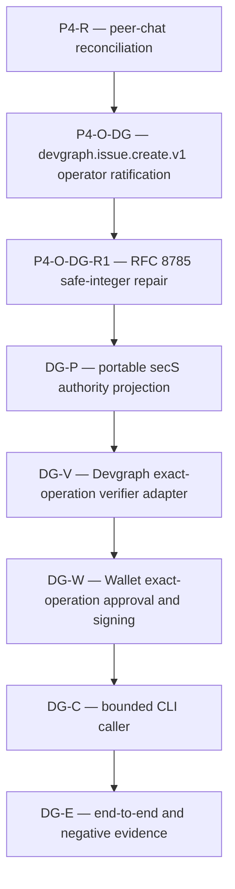

# `devgraph.issue.create.v1` stacked contract DAG

Date: 2026-08-31
Status: P4-O-DG-R1, DG-P, and DG-E1 merged; DG-E2 fixed one-shot Wallet adapter implemented on its branch; full cross-repository DG-E evidence remains unproven here
Contract: [../specs/devgraph-issue-create-v1.md](../specs/devgraph-issue-create-v1.md)
Predecessor: P4-R completed by Issue #270 / merged PR #271 / green post-merge Rust CI run `33448400000`

## Purpose

This plan registers the operator-ratified first exact Devgraph operation after
P4-R completed. It is a separate Devgraph-owned delivery branch, not a
relabeling of the Hermes P4-H/P4-S path and not a generic Work API
implementation plan.

## Dependency DAG



The serialized sequence is exactly:

```text
P4-R -> P4-O-DG -> P4-O-DG-R1 -> DG-P -> DG-V -> DG-W -> DG-C -> DG-E
```

## Node table

| Node | Status | Owner and exact objective | Gate |
|---|---|---|---|
| P4-R | Complete via #270/#271 | secS governance only: supersede peer chat and preserve exact-operation gate. | Merge `5dfeb950da1d6baf80d98e0843684625c9af6f4f` plus green post-merge Rust CI run `33448400000`. |
| P4-O-DG | Operator-ratified exact contract | secS contract: pin exactly `devgraph.issue.create.v1` and no runtime mechanism. | This contract merged with its static contract checks green. |
| P4-O-DG-R1 | Complete via #282 / merged PR #283 | secS contract only: bound every RFC 8785-canonicalized integer to the interoperable IEEE-754 safe range and pin cross-language vectors without changing v1 fields or semantics. | Merge `43d8904` preserves the static contract and canonicalization vectors. |
| DG-P | Complete; merged through PR #284 at `7233a80` | secS: fixed portable signed authority producer plus exact request/Wallet/policy verification and dedicated replay persistence; no route or generic operation. | Byte-exact producer vectors, strict decoders, Ed25519 signatures, exact expiry/replay, durable reopen, redaction, and denial matrix are covered by focused Rust tests. |
| DG-V | Owned by Devgraph; external state is not promoted by this secS branch | Devgraph: verify the exact secS projection and hand off only to canonical Issue creation/outbox. | Consumer vectors, exact operation/resource/request/idempotency binding, zero-effect denials, receipt correlation. |
| DG-W | Owned by Wallet; external state is not promoted by this secS branch | Wallet: add a user-confirmed exact v1 Ed25519 signing surface using the shared vector. | Chrome-owned approval, private-key non-disclosure, origin/operation disclosure, exact vector parity. |
| DG-C | Owned by Devgraph; external state is not promoted by this secS branch | Devgraph CLI/client: construct one bounded call without exposing credentials or caller-selected receiver controls. | Idempotent retry and safe output/denial behavior. |
| DG-E | Partial on this branch: DG-E1 merged; DG-E2 fixed Wallet adapter implemented | Cross-repository evidence: prove one create, exact duplicate, denial matrix, receipt correlation, and no credential/log leakage. | DG-E1 proves safe local projection production. DG-E2 adds only fixed one-shot Wallet-to-projection plumbing. Loaded-Wallet/browser acceptance and full reproducible cross-repository evidence remain separate. |

## Sequencing rules

- One node equals one issue and one PR in its owning repository.
- No implementation node begins before its predecessor is merged and green.
- Contract/vector changes land producer-first only after consumers can retain
  compatibility; exact shared fixtures must be byte-identical across repos.
- A defect outside a node's boundary creates a separate owner-specific repair
  node before dependent work resumes.
- Devgraph owns Work semantics and `EventReceipt`; secS verifies/routes; Wallet
  owns the root key and approval; the CLI only constructs the bounded call.
- `.castaway` is a vault and is not a DAG authority node.

## Current claim

P4-R and P4-O-DG are complete, and P4-O-DG-R1 merged through #282/PR #283.
Its safe-integer repair and `canonicalization-boundaries.json` vectors remain
the governing v1 canonicalization profile. DG-P merged through PR #284 as a
producer-only secS seam with portable consumer fixtures and durable replay.
DG-E1 merged as one fixed owner-private local adapter around DG-P. DG-E2 on
this branch adds one fixed-origin one-shot Wallet ceremony that closes before
invoking DG-E1's typed producer/output seam. This secS repository still does
not claim Devgraph Work mutation, a loaded-Wallet browser acceptance run,
transport/deployment, hybrid/PQ authorization, or cross-repository end-to-end
success evidence.
