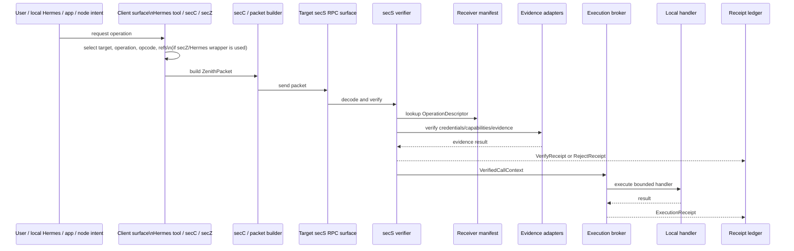

# secS-magik objectives specification

Repo-local copy imported from Claude Hub capture on 2026-06-01. This is the current implementation source of truth for the docs realignment pass.

## 0. Status

This is the current specification candidate for secS-magik after integrating the objectives re-architecture into the hardened node-permission pre-spec.

It is ready for review before repository implementation. It is a target/current architecture spec, not a claim that every verifier, receipt, manifest, or evidence component is already implemented. For implemented-vs-planned status, see `../implementation-status.md`.

## 1. Specification thesis

secS-magik is the generic permissioned RPC and verifier substrate for Castalia-compatible machine calls.

It must preserve the existing secS layer, current `ZenithPacket` v0 compatibility, `u8` opcode dispatch, and receiver-local opcode manifests, while turning the prototype into a real verifier pipeline with evidence adapters and receipts.

The corrected role split is:

```text
client-side surfaces
  local Hermes secS tool/script/skill, secC, or secZ
  turn user/local/node intent into a secS-magik-compatible message for a secS RPC surface

secS-magik / secS
  verifier and permissioned RPC substrate
  validates envelopes, signatures, presentations, replay/expiry, capabilities, credentials, evidence, and receipts

receiver-local manifest
  binds opcodes to operation descriptors and local handlers after secS verification
```

secZ is not the generic Castalia interface. secZ is not the verifier. It is one client-side/outgoing-call surface to secS. secC is the more generic/non-Zenith client form; secZ can be the Zenith-oriented client surface. A local Hermes operator may also invoke secS through a tool/script/skill without running a node or hitting a secZ server.

## 2. Non-goals

secS-magik must not own:

- Gallery product policy;
- app/browser login UX;
- ordinary WalletAuth HTTP sessions;
- Dregg consensus;
- public settlement;
- auction/business logic;
- arbitrary shell access;
- centralized Hub orchestration;
- Castalia membership semantics as a product authority.

Dregg, Midnight, and Cardano enter through typed evidence adapters. They do not replace the secS verifier boundary.

## 3. Preserved wire contract

The v0 packet remains:

```rust
pub struct ZenithPacket {
    pub session_id: [u8; 16],
    pub nonce: [u8; 12],
    pub opcode: u8,
    pub proof: Vec<u8>,
    pub claim_ttl: u64,
    pub encrypted_payload: Vec<u8>,
    pub mac: [u8; 16],
}
```

Rules:

1. `opcode: u8` stays as the bounded local intent selector.
2. The CLI decimal opcode rule stays: use `16`, not `0x10`, unless the CLI later explicitly adds hex parsing.
3. `proof` may carry a prototype proof envelope in v0, but the implementation must label that weakness and route it through typed verification stages.
4. `encrypted_payload` remains opaque to secS except for cryptographic/tunnel verification and handler handoff rules.
5. A future v1 envelope may be introduced only after actual verification and receipt implementation proves which fields cannot cleanly live in v0 plus descriptors/evidence refs.

## 4. Preserved opcode set

Current standard secS opcodes:

| Opcode | Decimal | Name | Status |
|---:|---:|---|---|
| `0x01` | `1` | `OPCODE_GENERATE` | preserved |
| `0x02` | `2` | `OPCODE_CHAT` | preserved |

Current secZ/local manifest bindings:

| Opcode | Decimal | Current binding | Status |
|---:|---:|---|---|
| `0x10` | `16` | Bash echo pipe | dev binding |
| `0x20` | `32` | Native Rust queue stub | first durable queue candidate |
| `0x30` | `48` | `jq .` JSON parser/formatter | dev binding |

Semantic operation names sit above local opcodes:

```text
agent.chat      -> local opcode chosen by receiver manifest
agent.complete  -> local opcode chosen by receiver manifest
queue.enqueue   -> local opcode 0x20 in the current prototype
```

Public operation names are for descriptors, capabilities, evidence policy, and cross-node readability. `u8` opcodes are for compact receiver-local dispatch.

## 5. Core objects

### 5.1 OperationDescriptor

Receiver-local manifests expose operation descriptors.

```rust
struct OperationDescriptor {
    opcode: u8,
    name: OperationName,
    payload_schema: PayloadSchemaId,
    target_kind: TargetKind,
    required_subject: SubjectRequirement,
    required_credentials: Vec<CredentialRequirement>,
    required_capabilities: Vec<CapabilityRequirement>,
    accepted_evidence: Vec<EvidenceKind>,
    replay_scope: ReplayScope,
    max_ttl_seconds: u64,
    handler_id: HandlerId,
}
```

Purpose:

- explain what a bare opcode means on this receiver;
- bind semantic operation names to local opcode dispatch;
- tell secS-magik which evidence and capability checks are required;
- keep handler binding receiver-sovereign.

### 5.2 VerifiedCallContext

secS emits `VerifiedCallContext` only after successful verification.

```rust
struct VerifiedCallContext {
    packet_hash: PacketHash,
    session_id: [u8; 16],
    nonce: [u8; 12],
    opcode: u8,
    operation: OperationName,
    subject: VerifiedSubject,
    target: TargetNode,
    audience: Audience,
    evidence_summary: EvidenceSummary,
    capability_result: CapabilityResult,
    credential_result: CredentialResult,
    expires_at: Timestamp,
}
```

Rules:

- Local handlers should receive a verified context, not raw trust assumptions.
- `VerifiedCallContext` may remain node-internal for v0.
- If serialized later, it must be signed or receipt-linked.

### 5.3 Receipt

Every packet produces a receipt.

```rust
enum ReceiptKind {
    Reject,
    Verify,
    Execute,
    Forward,
}

struct Receipt {
    receipt_id: ReceiptId,
    kind: ReceiptKind,
    packet_hash: PacketHash,
    session_id: [u8; 16],
    nonce: [u8; 12],
    opcode: u8,
    operation: Option<OperationName>,
    subject: Option<VerifiedSubject>,
    target: Option<TargetNode>,
    decision: Decision,
    reason: ReasonCode,
    evidence_summary: EvidenceSummary,
    handler_id: Option<HandlerId>,
    timestamp: Timestamp,
    signature_or_mac: ReceiptAuthenticator,
}
```

Purpose:

- audit;
- replay defense;
- debugging;
- future Dregg-shaped receipt composition;
- eventual proof export.

## 6. Verifier pipeline

secS-magik must implement verification as typed stages, not as one boolean proof check.

```text
RawBytes
  -> FrameBoundsCheck
  -> PacketDecode
  -> PacketShapeCheck
  -> VersionCompatibilityCheck
  -> SessionBindingCheck
  -> NonceReplayCheck
  -> ExpiryCheck
  -> MacOrTunnelCheck
  -> PresentationProofCheck
  -> AudienceOriginEndpointCheck
  -> OperationDescriptorLookup
  -> CredentialEvidenceCheck
  -> CapabilityCaveatCheck
  -> RevocationEvidenceCheck
  -> VerifiedCallContext | RejectReceipt
```

Required error codes:

```text
malformed_packet
packet_too_large
unsupported_version
expired_claim
replayed_nonce
bad_mac
missing_tunnel_key
invalid_presentation
wrong_audience
wrong_origin
unknown_operation
missing_credential
capability_denied
revoked
insufficient_evidence
handler_unavailable
internal_error
```

The current prototype check:

```rust
!packet.proof.is_empty() && packet.claim_ttl > 0
```

may only survive as `PrototypeProofEnvelope` during migration. It must not be described as real proof verification.

## 7. Client-side outgoing RPC role: local Hermes, secC, and secZ

The outgoing side is not always a node. An individual using local Hermes may invoke a secS tool/script/skill from their own machine. A service/node may also produce local runtime intent. Both cases need a client-side surface that constructs a secS-compatible packet.

Client-side surfaces:

| Surface | Role |
|---|---|
| local Hermes secS tool/script/skill | user-local operator path; can send a secS-compatible call without the user running a node or hitting a secZ server |
| secC | generic/non-Zenith client form: packet building, proof/presentation attachment, send/response handling |
| secZ | Zenith-oriented outgoing client surface: operation selection, local opcode/target selection, capability/credential ref attachment, then call into packet-builder/secC-like functionality |

These all represent clients of secS. The difference is packaging and vocabulary, not verifier ownership.

Outgoing flow:

```text
user / local Hermes / app / node intent
  -> client-side operation selection (local Hermes tool, secC, or secZ)
  -> operation name / local opcode / target node
  -> resource and payload construction
  -> capability / credential / evidence refs
  -> secS-magik-compatible ZenithPacket
  -> send to target secS RPC surface
```

secZ responsibilities, when secZ is the chosen client surface:

- select the intended operation;
- choose/resolve the receiver-compatible opcode;
- attach resource and payload bytes;
- attach capability, credential, and evidence refs;
- call packet builder / secC functionality;
- send to the target secS RPC endpoint.

secZ does not verify inbound authority. secZ does not decide generic Castalia membership. secZ does not replace secS-magik.

## 8. Receiver-local manifest role

On the receiving node, a manifest maps opcodes to operation descriptors and handlers.

```text
opcode 0x20
  -> operation queue.enqueue
  -> required evidence local_static | dregg_receipt | midnight_proof
  -> handler local_queue_bridge
```

Inbound flow:

```text
incoming ZenithPacket
  -> secS verifier pipeline
  -> receiver-local manifest lookup
  -> operation descriptor requirements
  -> evidence checks
  -> VerifiedCallContext
  -> execution broker
  -> local handler
  -> ExecutionReceipt
```

The manifest is not a bypass. It supplies operation meaning to the verifier and dispatch layer.

## 9. Evidence adapters

Evidence adapters are typed and optional per operation.

```rust
trait EvidenceAdapter {
    fn kind(&self) -> EvidenceKind;
    fn verify(&self, request: EvidenceRequest) -> EvidenceResult;
}
```

Initial adapters:

| Adapter | Purpose | Status |
|---|---|---|
| `local_static` | static/dev credentials, allowlists, fake roots | first implementation |
| `wallet_presentation` | Castalia Wallet challenge/signature/subject verification | first real auth seam |
| `dregg_receipt` | Dregg-shaped roots, caveats, receipts, revocation refs | later, after trait hardens |
| `midnight_proof` | selective-disclosure proof verification | first public proof rail |
| `cardano_settlement` | settlement/capital evidence for money operations | later |

Rules:

- No operation should require full Dregg unless the descriptor says it needs Dregg evidence.
- Dregg-unaware and Dregg-light nodes must remain valid deployment tiers.
- Midnight can be used before Dregg is a live runtime dependency.

## 10. Execution broker

Handlers run only after verification.

```rust
trait MachineProgram: Send + Sync {
    async fn execute(&self, context: &VerifiedCallContext, payload: &[u8]) -> ExecutionResult;
}
```

Approved handler modes:

- native Rust handler;
- queue bridge;
- bounded subprocess forwarder;
- local service adapter.

Execution requirements:

- timeout;
- max payload size;
- no broad ambient shell authority;
- explicit handler id in receipt;
- no payload content in logs by default;
- failure receipt on handler error.

## 11. Runtime modes

The current plaintext fallback should become explicit runtime mode.

| Mode | Meaning | Allowed use |
|---|---|---|
| `local_dev_plaintext` | no tunnel/MAC security; visible insecure mode | local demos only |
| `local_dev_tunnel` | tunnel key encryption/authentication | local integration |
| `production_verified` | no missing tunnel/MAC/session/evidence requirements | production-like use |

Rules:

- insecure mode must be opt-in;
- insecure mode must stamp logs/receipts;
- production mode must fail closed.

## 12. Event and receipt ledger

Replace thin telemetry with a local event/receipt ledger.

Events:

```text
packet_received
packet_rejected
packet_verified
operation_described
operation_routed
handler_started
handler_succeeded
handler_failed
receipt_emitted
```

Minimum local storage:

- SQLite in v0;
- runtime SQL, no compile-time SQLx macros unless offline cache is maintained;
- payload hashes, not payload contents, by default;
- receipt ids stable enough for audit references.

## 13. End-to-end lifecycle



## 14. Minimal implementation sequence

### Slice A — Documentation and types without behavior break

- Add this spec to repo docs.
- Define Rust types for `OperationDescriptor`, `VerifiedCallContext`, `Receipt`, and `VerificationError`.
- Preserve current CLI and packet behavior.
- Add regression tests for existing opcodes.

### Slice B — Verifier module extraction

- Move current proof/TTL/tunnel/session checks into `secs::Verifier`.
- Return typed `VerificationError` instead of boolean failure.
- Label current proof check as `PrototypeProofEnvelope`.

### Slice C — Receiver-local manifest

- Add manifest descriptors for `0x01`, `0x02`, `0x10`, `0x20`, `0x30`.
- Route descriptor lookup through secS verification.
- Keep dev bindings visibly marked.

### Slice D — Receipts and event ledger

- Emit `RejectReceipt`, `VerifyReceipt`, and `ExecutionReceipt`.
- Expand SQLite telemetry into receipt/event tables.
- Exclude payload contents by default.

### Slice E — First evidence adapter

- Implement `local_static` first for deterministic tests.
- Then implement `wallet_presentation` for real subject/key verification.
- Defer `dregg_receipt` until adapter request/response contracts are stable.

## 15. Implementation surfaces

- [[2026-06-01-secs-magik-implementation-issue-slices]] — instruction-level issue surface expanding the minimal sequence into repo paths, acceptance criteria, verification commands, stop conditions, and suggested GitHub issue titles.

## 16. Acceptance checks

- [ ] `cargo test --workspace` still passes.
- [ ] Current CLI decimal opcode examples still work.
- [ ] `ZenithPacket` v0 still round-trips.
- [ ] Unknown opcode produces typed reject receipt.
- [ ] Empty proof / zero TTL no longer silently means “maybe okay”; it returns typed verifier failure.
- [ ] Dev plaintext mode is explicit and visibly stamped.
- [ ] Client docs distinguish local Hermes secS tool/script/skill, secC, and secZ as client-side ways to call secS.
- [ ] secZ docs say outgoing/client-side RPC construction, not Castalia interface or verifier.
- [ ] secS-magik docs say verifier/RPC substrate, not product policy.
- [ ] Local manifest owns opcode meaning.
- [ ] Dregg remains optional evidence, not mandatory runtime.

## 17. Review questions before implementation

1. Should `OperationDescriptor` live in `core/` from the first slice, or in a new `manifest/` module until it hardens?
2. Should `VerifiedCallContext` remain process-internal in v0, or should it be serializable behind a feature flag?
3. Should receipts be authenticated by the secS verifier key, node identity key, or local MAC first?
4. Should `0x01`/`0x02` remain legacy secS examples while Castalia operations start at `0x10+`, or should `agent.chat` map directly onto `0x02`?
5. Is `wallet_presentation` the first real evidence adapter after `local_static`, or should Midnight proof refs come first?

---

Areas:
- [[secS]]
- [[secZ]]
- [[Zenith]]
- [[projects]]
- [[planning]]
